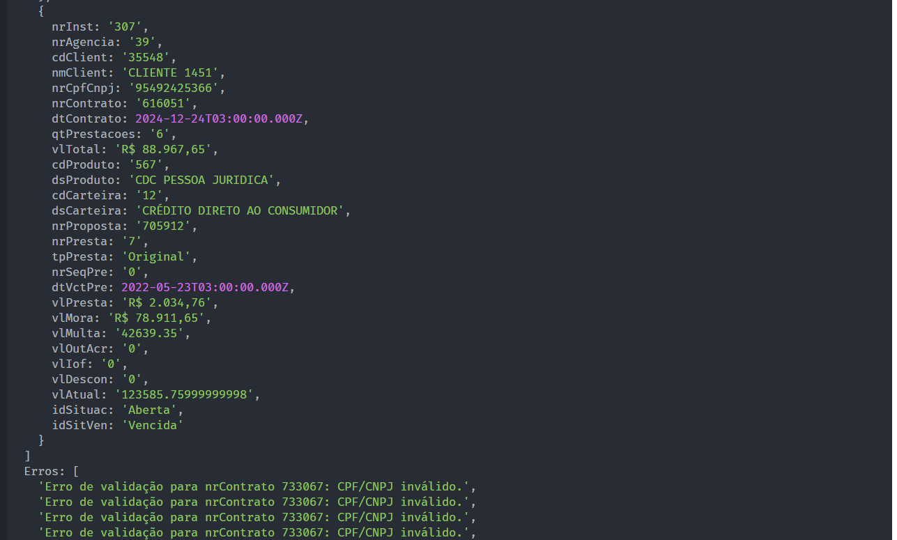

# Manipulação de CSV em TypeScript (TESTE KRONOOS)

Este projeto em TypeScript realiza a leitura de dados em formato CSV, realiza algumas manipulações e validações, e exibe os resultados no console.



## Estrutura do Projeto

O projeto está organizado da seguinte forma:

- `src/`: Contém o código-fonte TypeScript.
  - `helpers/`: Funções auxiliares e utilitários.
    - `CsvReader.ts`: Leitura de arquivos CSV.
    - `CurrencyFormatter.ts`: Formatação de valores monetários.
    - `CpfCnpjValidator.ts`: Validação de CPF ou CNPJ.
    - `DateConverter.ts`: Conversão de datas para o tipo `Date`.
  - `processors/`: Classes responsáveis pelo processamento dos dados.
    - `DataProcessor.ts`: Processamento principal dos dados.
  - `index.ts`: Arquivo principal para iniciar o aplicativo.

## Como Executar o Projeto

Certifique-se de ter o Node.js instalado. Este projeto utiliza o gerenciador de pacotes [PNPM](https://pnpm.io/) para instalar e gerenciar as dependências. Se você não tiver o PNPM instalado globalmente, você pode instalá-lo utilizando o seguinte comando:

1. Instale as dependências:

   ```bash
   npm install -g pnpm
   ```

2. Instale as Dependências com o PNPM:

   ```bash
   pnpm install
   ```

3. Execute o script principal:

   ```bash
   pnpm start
   ```

4. Execute os Testes (opcional):

   ```bash
   pnpm test
   ```

Este script realizará a leitura do arquivo CSV, processará os dados e exibirá os resultados no console.

## Arquivo de Dados

Certifique-se de ter um arquivo data.csv na raiz do projeto em "./csvs" com os dados a serem processados.

## Dependências

O projeto utiliza as seguintes dependências:

- [`fs`](https://nodejs.org/api/fs.html): Módulo File System para leitura de arquivos.
- [`csv-parser`](https://www.npmjs.com/package/csv-parser): Parser de CSV para JavaScript.
- [`date-fns`](https://date-fns.org/): Biblioteca para manipulação de datas.
- [`cpf-cnpj-validator`](https://www.npmjs.com/package/cpf-cnpj-validator): Validador de CPF e CNPJ.
- [`ts-node`](https://www.npmjs.com/package/ts-node): Execução de scripts TypeScript diretamente.
- [`nodemon`](https://www.npmjs.com/package/nodemon): Monitoramento de alterações e reinício automático.
- [`jest`](https://jestjs.io/): Estrutura de teste para JavaScript/TypeScript.
- [`ts-jest`](https://www.npmjs.com/package/ts-jest): Configuração do Jest para TypeScript.

## Contribuição

Sinta-se à vontade para contribuir, abrir issues ou fornecer feedback. Todas as contribuições são bem-vindas!
